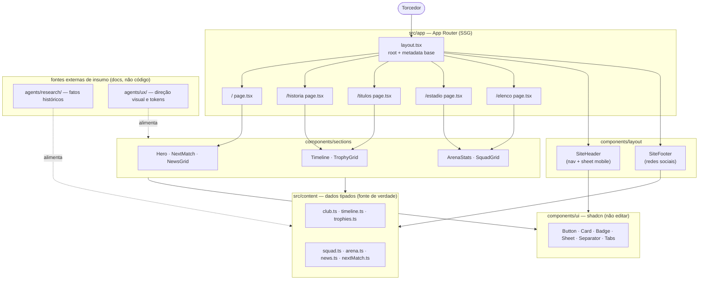

# Arquitetura — Site Galo

Site institucional/torcedor sobre o Clube Atlético Mineiro. **Conteúdo estático, sem backend, sem CMS, sem autenticação.** Stack em [[tech-stack]].

## Princípio arquitetural

> **Conteúdo é dado, não markup.**

Nenhum fato do clube (ano de fundação, título, jogador, capacidade da arena) fica hardcoded dentro de JSX. Tudo vive em módulos tipados sob `src/content/`, e as páginas apenas mapeiam esses dados em componentes de seção. Isso permite que o `sites-analyst` corrija/enriqueça fatos sem tocar em layout, e que o `sites-ux` altere layout sem tocar em fatos.

Desvio desse princípio exige ADR.

## Mapa de rotas

| Rota | Página | Renderização | Propósito |
|---|---|---|---|
| `/` | Home | SSG | Hero, próximo jogo, últimas notícias, prévia de história/títulos |
| `/historia` | História | SSG | Linha do tempo 1908 → hoje |
| `/titulos` | Títulos | SSG | Conquistas agrupadas por competição |
| `/estadio` | Estádio | SSG | Arena MRV — números, galeria, localização |
| `/elenco` | Elenco | SSG | Elenco atual (estático/ilustrativo, por posição) |
| `/quiz` | Quiz | SSG + ilha client ([[../decisions/ADR-001-quiz-client-island\|ADR-001]]) | Quiz de múltipla escolha (8–10 perguntas) com resultado por faixa. Último item do menu |

URLs em pt-BR **sem acento e sem hífen desnecessário**. Sem página `/contato`: contato e redes sociais vivem no footer global.

## Diagrama



## Estrutura de pastas

```
src/
├── app/
│   ├── layout.tsx            # Root layout: <html lang="pt-BR">, fontes, Header, Footer, metadata base
│   ├── page.tsx              # Home
│   ├── globals.css           # @import "tailwindcss" + @theme (tokens do Galo) + @utility
│   ├── not-found.tsx         # 404 temático
│   ├── sitemap.ts            # sitemap.xml gerado
│   ├── robots.ts             # robots.txt gerado
│   ├── historia/page.tsx
│   ├── titulos/page.tsx
│   ├── estadio/page.tsx
│   ├── elenco/page.tsx
│   └── quiz/page.tsx         # SSG; valida content em build; monta <QuizRunner> (story 2.1)
├── components/
│   ├── ui/                   # shadcn/ui — NUNCA editar direto, criar wrapper
│   ├── layout/
│   │   ├── site-header.tsx   # "use client" (menu mobile)
│   │   ├── site-footer.tsx   # server component
│   │   └── mobile-nav.tsx    # "use client" — Sheet
│   ├── sections/             # uma seção = um bloco visual de página
│   │   ├── hero.tsx
│   │   ├── next-match.tsx
│   │   ├── news-grid.tsx
│   │   ├── history-preview.tsx
│   │   ├── trophy-highlights.tsx
│   │   ├── timeline.tsx
│   │   ├── trophy-grid.tsx
│   │   ├── arena-stats.tsx
│   │   ├── arena-gallery.tsx
│   │   ├── squad-grid.tsx
│   │   └── quiz-runner.tsx   # "use client" — única ilha interativa (ADR-001)
│   └── shared/
│       ├── section-heading.tsx
│       ├── reveal.tsx        # "use client" — wrapper Motion whileInView
│       └── stat-card.tsx
├── content/                  # FONTE DE VERDADE DO CONTEÚDO
│   ├── club.ts               # identidade, redes sociais, dados institucionais
│   ├── timeline.ts           # marcos históricos
│   ├── trophies.ts           # conquistas
│   ├── squad.ts              # elenco ilustrativo
│   ├── arena.ts              # Arena MRV
│   ├── news.ts               # notícias estáticas/editoriais
│   ├── next-match.ts         # próximo jogo (estático)
│   ├── quiz.ts               # perguntas + faixas de resultado (story 2.1)
│   └── navigation.ts         # itens de nav (header/footer)
├── lib/
│   ├── utils.ts              # cn()
│   ├── seo.ts                # buildMetadata() helper
│   └── quiz.ts               # scoreQuiz / getResultTier / assertQuizIntegrity (puras)
└── types/
    └── content.ts            # interfaces de todo o conteúdo
public/
├── images/                   # hero, arena, elenco, escudo (assets de origem livre)
└── og/                       # imagens Open Graph
```

## Camadas e regras de dependência

```
app/ (rotas)  →  components/sections  →  components/shared + components/ui
                          ↓
                     src/content  →  src/types
```

- `src/content/` **não importa nada de React.** É dado puro.
- `components/ui/` não importa de `sections/` nem de `content/`.
- `sections/` recebe dados por props sempre que possível; importar de `content/` direto é aceito na página, não no componente reutilizável.
- Server Component é o padrão. `"use client"` apenas em: `site-header` (menu), `mobile-nav`, `reveal`, `sections/quiz-runner` ([[../decisions/ADR-001-quiz-client-island|ADR-001]]) e qualquer componente com `motion/react`.
- `src/lib/quiz.ts` é a fonte única de pontuação/faixa do quiz (funções puras); `app/quiz/page.tsx` valida o conteúdo em build via `assertQuizIntegrity`.

## SEO e acessibilidade — estrutura

- Um único `<h1>` por rota; hierarquia `h1 → h2 → h3` sem pular nível.
- `generateMetadata`/`metadata` por rota com `title`, `description`, `alternates.canonical`, `openGraph`.
- JSON-LD `SportsTeam` no layout raiz; `SportsActivityLocation` na rota `/estadio`.
- `sitemap.ts` e `robots.ts` gerados pelo Next, cobrindo as 6 rotas (incl. `/quiz`, story 2.1).
- Navegação por teclado completa; foco visível; `alt` descritivo em toda imagem; contraste AA (crítico: paleta preto/branco do clube).
- Animações respeitam `prefers-reduced-motion`.

## Fontes de insumo (documentos, não código)

| Insumo | Path | Dono |
|---|---|---|
| Fatos históricos, títulos, datas, Arena | `docs/smart-memory/agents/research/` | sites-analyst (pesq) |
| Direção visual, paleta, tipografia, tom | `docs/smart-memory/agents/ux/` | sites-ux (ux) |

O implementer **deve consultar esses dois diretórios antes de preencher `src/content/` e antes de definir o bloco `@theme`.** Se estiverem vazios no momento da implementação, usar placeholders marcados com `// TODO(pesq)` / `// TODO(ux)` e reportar — nunca inventar fato histórico como se fosse verificado.

## Relacionados

- [[tech-stack]] · [[modules]] · [[../stories/BACKLOG]]
